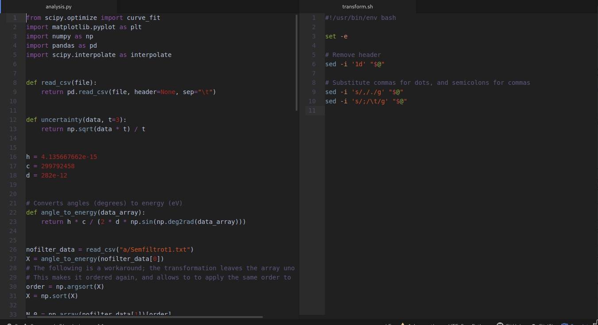

# NERV-ous syntax theme

A colorscheme based on evangelion. Actually a port of the [vim
theme](https://github.com/dread-uo/NERV-ous).

As this is my first experience on syntax themes, there's home for lots of
improvement.  If you feel like opening some issues or pull requests, don't
hesitate :)

